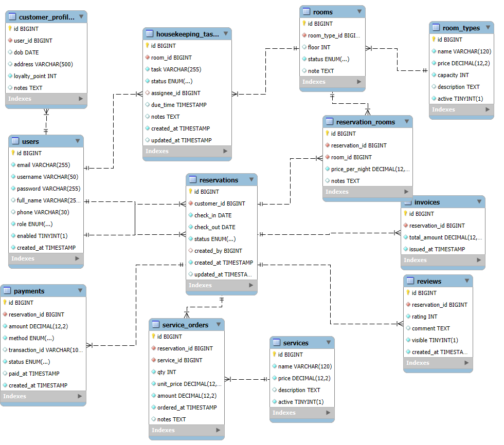

## Smart Hotel Management – Topic Requirements & Database Schema

### Introduction
An intelligent hotel management system that supports online room booking, stay services, payments, and management reports. The goal is to enhance guest experience while optimizing operations for hotel staff and management.

### Topic Requirements
- **Architecture**: Backend using Spring MVC (Spring Boot) with Spring Security for authentication/authorization; Frontend using ReactJS; communication via RESTful APIs.
- **Authentication**: Local registration/login and optional OAuth2 (Google/Facebook). Store passwords with BCrypt; use JWT for client authentication.
- **Admin Portal**: Manage users/roles, room types/rooms, multi-room reservations per order, services, payments, invoices, housekeeping tasks, review moderation, and reports.
- **Client Portal**: Search room availability by date/type/price, book rooms (multiple rooms per reservation), add-on services, make payments, receive invoices, submit reviews, and manage profile.
- **Reports/Analytics**: Occupancy rate, revenue by period, top services, and customer ratings.
- **Roles**: `ADMIN`, `RECEPTION`, `HOUSEKEEPING`, `ACCOUNTANT`, `CUSTOMER` with proper endpoint authorization.

### Database Schema Diagram (Image)

